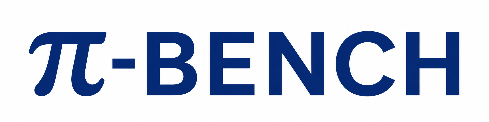

<p align="center">
  
</p>

<h1 align="center">Evaluating Proactive Personal Assistant Agents in Long-Horizon Workflow</h1>

<p align="center">
  <a href="https://arxiv.org/abs/2605.14678">
    
  </a>
  <a href="https://simplified-reasoning.github.io/Pi-Bench/">
    
  </a>
</p>

---

## 🧭 Introduction

`π-BENCH` is a benchmark for **proactive personal assistant agents** in
long-horizon workflows, where users start with underspecified requests and
important requirements emerge across interaction. It contains **100 multi-turn
tasks** across **5 domain-specific personas** (`researcher`, `marketer`,
`pharmacist`, `law_trainee`, `financier`) and organizes them as multi-session
episodes in persistent workspaces.

The benchmark jointly measures **Proactivity (PROC)** and **Completeness
(COMP)**. PROC evaluates whether an agent resolves hidden intents early (through
inference or focused elicitation) to reduce avoidable user burden, while COMP
evaluates whether final deliverables satisfy checklist requirements and
artifact-level obligations. Scoring combines rubric-based hidden-intent
judgment and checklist validation, and audit results show low
judge disagreement (**<4%**), which supports evaluation reliability.

Compared with benchmarks focused mainly on short-horizon tasks, GUI/mobile
interactions, or memory retrieval alone, `π-BENCH` emphasizes **persistent,
artifact-centric workflows** with **hidden intents**, **inter-task
dependencies**, and **cross-session continuity**, enabling clearer separation
between reactive task completion and proactive assistance quality.

## 🏆 Leaderboard

Overall results for `Proc / Comp` (%). Results are averaged over three runs,
with subscripts denoting standard deviation.

| Model | Average&nbsp;Proc | Average&nbsp;Comp | Researcher | Marketer | Pharmacist | Law&nbsp;Trainee | Financier |
| --- | --- | --- | --- | --- | --- | --- | --- |
| GPT-5.4 | **67.0**<sub>2.1</sub> | 65.6<sub>1.8</sub> | 46.0&nbsp;/&nbsp;66.4 | **78.2**&nbsp;/&nbsp;67.1 | 75.9&nbsp;/&nbsp;71.5 | **56.9&nbsp;/&nbsp;61.9** | **78.1**&nbsp;/&nbsp;61.2 |
| Gemini&nbsp;3.1&nbsp;Pro | 57.1<sub>0.9</sub> | 60.0<sub>0.8</sub> | 41.1&nbsp;/&nbsp;59.2 | 65.0&nbsp;/&nbsp;62.1 | 71.0&nbsp;/&nbsp;72.1 | 50.0&nbsp;/&nbsp;55.3 | 58.6&nbsp;/&nbsp;51.1 |
| Claude&nbsp;Opus&nbsp;4.6 | 65.5<sub>1.4</sub> | **67.6**<sub>1.5</sub> | **50.3&nbsp;/&nbsp;74.5** | 75.0&nbsp;/&nbsp;**74.6** | **82.8**&nbsp;/&nbsp;68.6 | 45.7&nbsp;/&nbsp;57.2 | 73.8&nbsp;/&nbsp;**63.2** |
| DeepSeek&nbsp;V3.2 | 53.3<sub>1.9</sub> | 57.8<sub>3.0</sub> | 29.0&nbsp;/&nbsp;66.9 | 69.1&nbsp;/&nbsp;59.4 | 75.9&nbsp;/&nbsp;62.6 | 33.2&nbsp;/&nbsp;51.1 | 59.1&nbsp;/&nbsp;48.9 |
| MiniMax&nbsp;M2.7 | 55.6<sub>3.2</sub> | 60.0<sub>1.8</sub> | 33.4&nbsp;/&nbsp;63.9 | 71.9&nbsp;/&nbsp;61.9 | 77.1&nbsp;/&nbsp;63.6 | 38.6&nbsp;/&nbsp;52.5 | 57.2&nbsp;/&nbsp;58.1 |
| Kimi&nbsp;K2.5 | 43.1<sub>0.2</sub> | 61.6<sub>1.9</sub> | 28.9&nbsp;/&nbsp;63.5 | 41.2&nbsp;/&nbsp;62.3 | 70.1&nbsp;/&nbsp;**74.8** | 34.8&nbsp;/&nbsp;54.4 | 40.4&nbsp;/&nbsp;52.9 |
| Seed2.0&nbsp;Pro | 58.4<sub>0.9</sub> | 52.1<sub>3.8</sub> | 38.9&nbsp;/&nbsp;59.6 | 71.4&nbsp;/&nbsp;44.2 | 77.0&nbsp;/&nbsp;67.6 | 46.0&nbsp;/&nbsp;44.7 | 58.7&nbsp;/&nbsp;44.5 |
| GLM-5.1 | 58.4<sub>0.8</sub> | 63.6<sub>2.9</sub> | 41.8&nbsp;/&nbsp;61.6 | 62.6&nbsp;/&nbsp;69.1 | 75.2&nbsp;/&nbsp;70.3 | 45.5&nbsp;/&nbsp;57.3 | 66.7&nbsp;/&nbsp;59.8 |
| Qwen3.6&nbsp;Plus | 64.0<sub>1.1</sub> | 64.1<sub>0.6</sub> | 40.1&nbsp;/&nbsp;70.0 | 77.5&nbsp;/&nbsp;66.6 | 79.7&nbsp;/&nbsp;70.2 | 45.7&nbsp;/&nbsp;60.2 | 77.1&nbsp;/&nbsp;53.6 |

## 🧰 Setup

1. Create and activate a Python environment:

```bash
conda create -n pi-bench python=3.11
conda activate pi-bench
```

2. Install local dependencies and prepare AppWorld data:

```bash
pip install -e .
pip install -e third_party/nanobot
bash scripts/setup_appworld.sh
```

3. Create a local environment file and fill in the provider credentials:

```bash
cp env.example.sh env.sh
```

The template leaves all values empty. Edit `env.sh` with your local credentials,
then source it in every shell where you run the benchmark:

```bash
source env.sh
```

`env.sh` is ignored by git. The default model configs read credentials from
`MODEL_BASE_URL`, `MODEL_API_KEY`, `USER_BASE_URL`, `USER_API_KEY`,
`JUDGER_BASE_URL`, `JUDGER_API_KEY`, and `BRAVE_SEARCH_API_KEY`. These values
fill the placeholders in `config/models/*.yaml`, such as
`config/models/example.full.yaml`.

4. Pull the benchmark Docker image:

```bash
docker pull zzzhr97/pi-bench:latest
```

5. Optionally edit the target model file under `config/models/`.

Most users only need to configure `env.sh`. Edit `config/models/<model-id>.yaml`
only when you need to change model names, endpoints, proxy settings, timeouts,
or other per-model overrides. The YAML filename stem is the model id passed to
`pibench`; see `config/models/example.full.yaml` for the complete schema.

## ▶️ Run

Run from the repository root:

```bash
pibench --model-id deepseek-v3.2
```

Run multiple models:

```bash
pibench --model-id deepseek-v3.2,MiniMax-M2.5
```

Run a specific user:

```bash
pibench --user-id law_trainee --model-id deepseek-v3.2
```

Run multiple users and models in one command:

```bash
pibench --user-id researcher,law_trainee --model-id deepseek-v3.2,MiniMax-M2.5
```

Repeated runs can be requested with `--run`. The launcher writes each repeated
run to a distinct output directory with a `__runNN` suffix:

```bash
pibench --user-id law_trainee --model-id deepseek-v3.2 --run 3
```

## 📦 Outputs

Results and logs are written under:

```text
outputs/<model-id>/<user-id>/
```

Runtime logs for each container run are under:

```text
outputs/<model-id>/<user-id>/run/<timestamp>-runtime/
```
