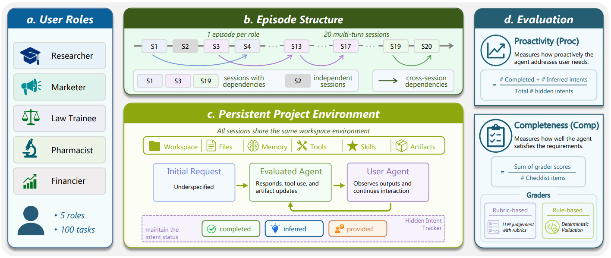

<h1 align="center">π-Bench: Evaluating Proactive Personal Assistant Agents in Long-Horizon Workflows</h1>

<p align="center">
  
</p>

<p align="center">
  <a href="https://arxiv.org/abs/2605.14678">
    
  </a>
  <a href="https://simplified-reasoning.github.io/Pi-Bench/">
    
  </a>
  <a href="https://github.com/Simplified-Reasoning/Pi-Bench">
    
  </a>
  <a href="https://huggingface.co/datasets/zzzhr97/Pi-Bench">
    
  </a>
  <a href="https://huggingface.co/papers/2605.14678">
    
  </a>
</p>

<p align="center">
  <a href="#news">📢 News</a> •
  <a href="#introduction">🧭 Introduction</a> •
  <a href="#leaderboard">🏆 Leaderboard</a> •
  <a href="#setup">🚀 Getting Started</a>
</p>
<p align="center">
  <a href="#run">🛠️ Run</a> •
  <a href="#outputs">📦 Outputs</a> •
  <a href="#acknowledgement">🙏 Acknowledgement</a> •
  <a href="#citation">📚 Citation</a>
</p>

---

<a id="news"></a>
## 📢 News

- [May 2026] `π-BENCH` is available on arXiv: [2605.14678](https://arxiv.org/abs/2605.14678).
- [May 2026] Project page is online: https://simplified-reasoning.github.io/Pi-Bench/

<a id="introduction"></a>
## 🧭 Introduction

`π-BENCH` evaluates **proactive personal assistant agents** in long-horizon,
multi-session workflows. It contains **100 multi-turn tasks** across **5
personas** (`researcher`, `marketer`, `pharmacist`, `law_trainee`,
`financier`) in persistent workspaces where user requirements are often
underspecified and emerge over time.

The benchmark reports **Proactivity (PROC)** and **Completeness (COMP)**. PROC
measures whether an agent discovers or infers hidden intents early; COMP
measures whether final artifacts satisfy checklist requirements. Unlike
short-horizon, GUI/mobile, or memory-only benchmarks, `π-BENCH` focuses on
persistent artifact workflows with hidden intents, inter-task dependencies, and
cross-session continuity.

<a id="leaderboard"></a>
## 🏆 Leaderboard

Overall `Proc / Comp` results (%). Leaderboard scores are the mean of three
runs, e.g. `pibench --model-id deepseek-v3.2 --run 3`; small subscripts show
the standard deviation.

| Model | Average&nbsp;Proc | Average&nbsp;Comp | Researcher | Marketer | Pharmacist | Law&nbsp;Trainee | Financier |
| --- | --- | --- | --- | --- | --- | --- | --- |
| GPT-5.4 | **67.0**<sub>2.1</sub> | 65.6<sub>1.8</sub> | 46.0&nbsp;/&nbsp;66.4 | **78.2**&nbsp;/&nbsp;67.1 | 75.9&nbsp;/&nbsp;71.5 | **56.9**&nbsp;/&nbsp;**61.9** | 78.1&nbsp;/&nbsp;61.2 |
| Gemini&nbsp;3.1&nbsp;Pro | 57.1<sub>0.9</sub> | 60.0<sub>0.8</sub> | 41.1&nbsp;/&nbsp;59.2 | 65.0&nbsp;/&nbsp;62.1 | 71.0&nbsp;/&nbsp;72.1 | 50.0&nbsp;/&nbsp;55.3 | 58.6&nbsp;/&nbsp;51.1 |
| Claude&nbsp;Opus&nbsp;4.6 | 65.5<sub>1.4</sub> | **67.6**<sub>1.5</sub> | **50.3**&nbsp;/&nbsp;**74.5** | 75.0&nbsp;/&nbsp;**74.6** | **82.8**&nbsp;/&nbsp;68.6 | 45.7&nbsp;/&nbsp;57.2 | 73.8&nbsp;/&nbsp;**63.2** |
| DeepSeek&nbsp;V3.2 | 53.3<sub>1.9</sub> | 57.8<sub>3.0</sub> | 29.0&nbsp;/&nbsp;66.9 | 69.1&nbsp;/&nbsp;59.4 | 75.9&nbsp;/&nbsp;62.6 | 33.2&nbsp;/&nbsp;51.1 | 59.1&nbsp;/&nbsp;48.9 |
| MiniMax&nbsp;M2.7 | 55.6<sub>3.2</sub> | 60.0<sub>1.8</sub> | 33.4&nbsp;/&nbsp;63.9 | 71.9&nbsp;/&nbsp;61.9 | 77.1&nbsp;/&nbsp;63.6 | 38.6&nbsp;/&nbsp;52.5 | 57.2&nbsp;/&nbsp;58.1 |
| Kimi&nbsp;K2.5 | 61.4<sub>2.1</sub> | 53.9<sub>0.8</sub> | 39.4&nbsp;/&nbsp;52.6 | 68.2&nbsp;/&nbsp;59.7 | 81.8&nbsp;/&nbsp;78.3 | 46.5&nbsp;/&nbsp;44.4 | 71.1&nbsp;/&nbsp;34.4 |
| Kimi&nbsp;K2.6 | 63.8<sub>1.3</sub> | 62.0<sub>1.2</sub> | 43.9&nbsp;/&nbsp;60.3 | 69.5&nbsp;/&nbsp;69.6 | 77.8&nbsp;/&nbsp;**85.3** | 48.7&nbsp;/&nbsp;55.5 | **79.2**&nbsp;/&nbsp;39.4 |
| Seed2.0&nbsp;Pro | 58.4<sub>0.9</sub> | 52.1<sub>3.8</sub> | 38.9&nbsp;/&nbsp;59.6 | 71.4&nbsp;/&nbsp;44.2 | 77.0&nbsp;/&nbsp;67.6 | 46.0&nbsp;/&nbsp;44.7 | 58.7&nbsp;/&nbsp;44.5 |
| GLM-5.1 | 58.4<sub>0.8</sub> | 63.6<sub>2.9</sub> | 41.8&nbsp;/&nbsp;61.6 | 62.6&nbsp;/&nbsp;69.1 | 75.2&nbsp;/&nbsp;70.3 | 45.5&nbsp;/&nbsp;57.3 | 66.7&nbsp;/&nbsp;59.8 |
| Qwen3.6&nbsp;Plus | 64.0<sub>1.1</sub> | 64.1<sub>0.6</sub> | 40.1&nbsp;/&nbsp;70.0 | 77.5&nbsp;/&nbsp;66.6 | 79.7&nbsp;/&nbsp;70.2 | 45.7&nbsp;/&nbsp;60.2 | 77.1&nbsp;/&nbsp;53.6 |

<a id="setup"></a>
## 🧰 Setup

1. Create and activate a Python environment:

```bash
conda create -n pi-bench python=3.11
conda activate pi-bench
```

2. Install local dependencies and prepare AppWorld data:

```bash
pip install -e .
pip install -e third_party/nanobot
bash scripts/setup_appworld.sh
```

3. Create a local environment file:

```bash
cp env.example.sh env.sh
```

Edit `env.sh` with your credentials, then run `source env.sh`. The default
model configs read `MODEL_BASE_URL`, `MODEL_API_KEY`, `USER_BASE_URL`,
`USER_API_KEY`, `JUDGER_BASE_URL`, `JUDGER_API_KEY`, and
`BRAVE_SEARCH_API_KEY`.

4. Pull the benchmark Docker image:

```bash
docker pull zzzhr97/pi-bench:latest
```

5. Optional: edit `config/models/<model-id>.yaml` for model-specific names,
endpoints, proxy settings, or timeouts. The filename stem is the `pibench`
model id; see `config/models/example.full.yaml` for the full schema.

<a id="run"></a>
## ▶️ Run

Run from the repository root. Use `--run 3` for leaderboard-style reporting:

```bash
pibench --model-id deepseek-v3.2 --run 3
```

Each repeat is written to a separate `__runNN` output directory. If a repeated
run is interrupted or fails, rerun only the missing/failed repeat with:

```bash
pibench --model-id deepseek-v3.2 --run 3 --rerun-failed
```

Completed repeats are reused and are not launched again.

Additional examples:

| Goal | Command |
| --- | --- |
| Single trial | `pibench --model-id deepseek-v3.2` |
| Specific user | `pibench --user-id law_trainee --model-id deepseek-v3.2` |
| Multiple models | `pibench --model-id deepseek-v3.2,MiniMax-M2.5` |
| Multiple users and models | `pibench --user-id researcher,law_trainee --model-id deepseek-v3.2,MiniMax-M2.5` |

<a id="outputs"></a>
## 📦 Outputs

Main outputs:

```text
outputs/<model-id>/<user-id>/
```

Container runtime logs:

```text
outputs/<model-id>/<user-id>/run/<timestamp>-runtime/
```

<a id="acknowledgement"></a>
## 🙏 Acknowledgement

Pi-Bench is built on AppWorld and NanoBot. We thank the contributors to these
open-source projects.

<a id="citation"></a>
## 📚 Citation

```bibtex
@misc{zhang2026pibenchevaluatingproactivepersonal,
  title={$\pi$-Bench: Evaluating Proactive Personal Assistant Agents in Long-Horizon Workflows},
  author={Haoran Zhang and Luxin Xu and Zhilin Wang and Runquan Gui and Shunkai Zhang and Haodi Lei and Zihao He and Bingsu He and Chicheng Qin and Tong Zhu and Xiaoye Qu and Yang Yang and Yu Cheng and Yafu Li},
  year={2026},
  eprint={2605.14678},
  archivePrefix={arXiv},
  primaryClass={cs.AI},
  url={https://arxiv.org/abs/2605.14678}
}
```
